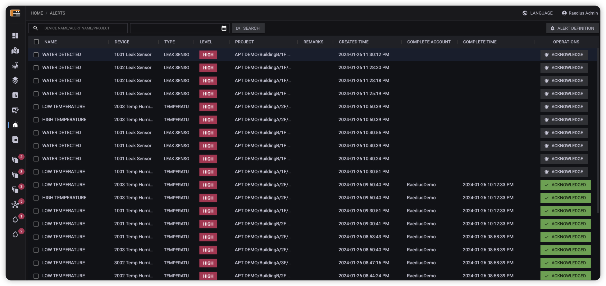
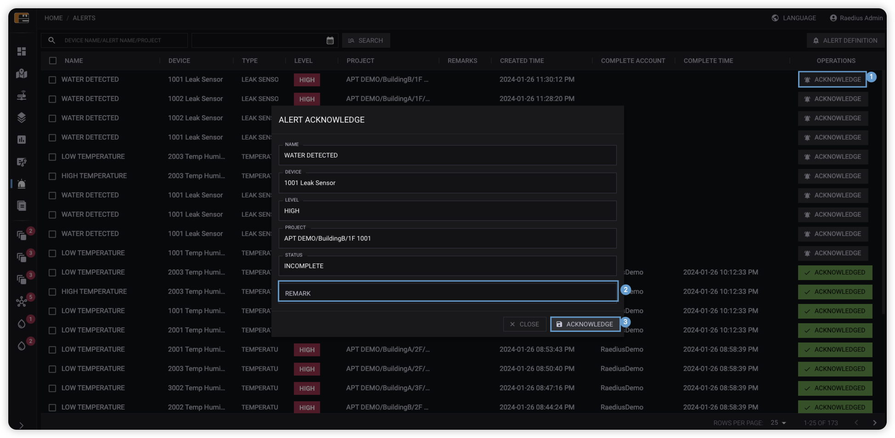
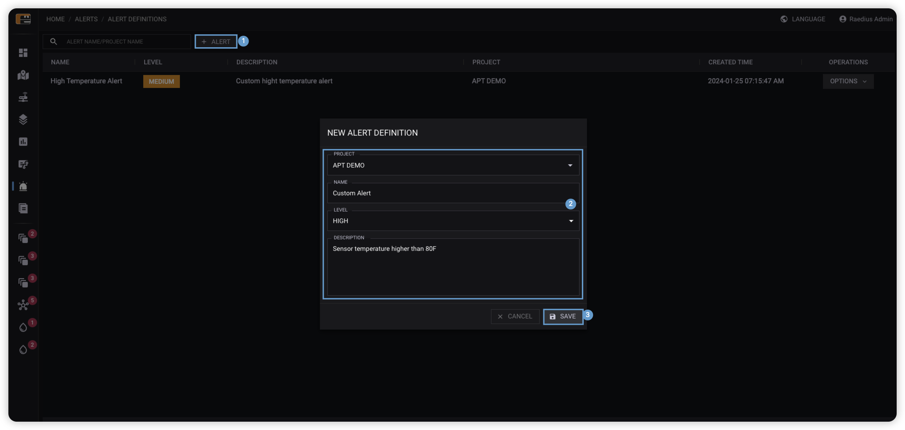
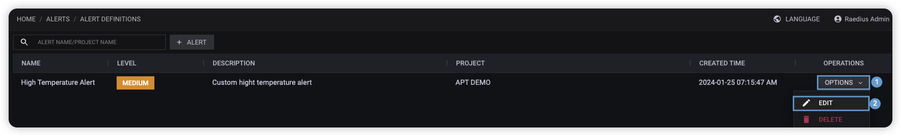
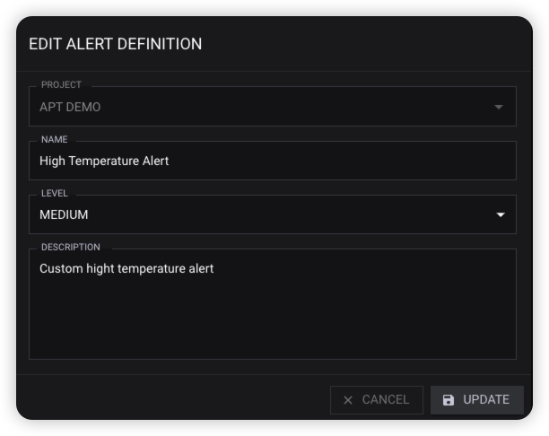
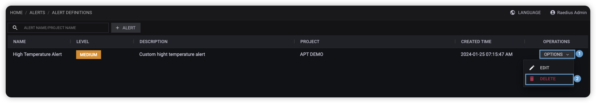
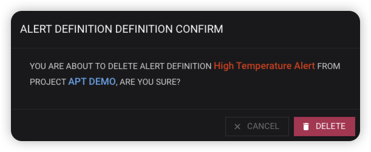

  

## 数据来源

* 设备个性化告警
* 客户自定义告警

## 告警确认

当我们确认设备的告警已经解除后，需要手动确认告警事件。

  

1. 点击需要确认的告警记录，点击**确认按钮**。
2. 在告警确认弹框中填写事件备注（可选）。
3. 在告警确认弹框中点击**确认**按钮完成告警确认操作。

## 自定义告警

当系统默认的告警不满足使用需求时，用户可自行定义告警类型。

自定义告警：**告警中心>自定义告警**

### 创建自定义告警

  

1. 点击**告警**按钮。
2. 在告警定义弹框表单中填写告警定义内容。
3. 在告警定义弹框中点击**保存**按钮完成告警定义创建操作。

### 更新自定义告警

  
  

1. 找到需要修改的告警定义记录，点击记录的**操作**按钮。
2. 在操作下拉框中，点击**编辑**。
3. 在告警定义弹框表单中修改告警定义内容。
4. 在告警定义弹框中点击**更新**按钮完成告警定义更新操作。

### 删除自定义告警

  
  

1. 找到需要删除的告警定义记录，点击记录的**操作**按钮。
2. 在操作下拉框中，点击**删除**。
3. 在告警定义删除确认弹框中点击**删除**按钮完成告警定义删除。
