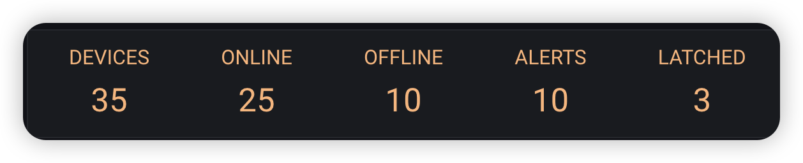
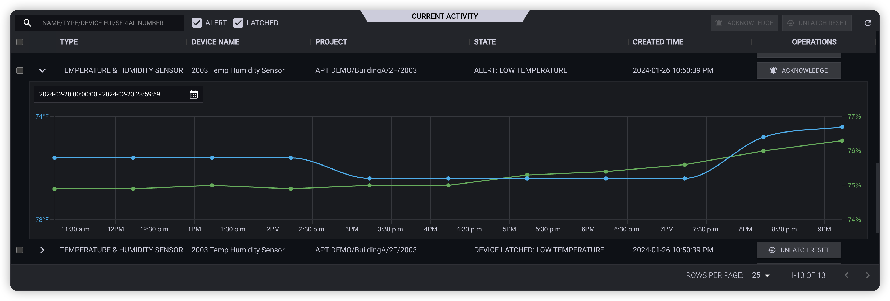
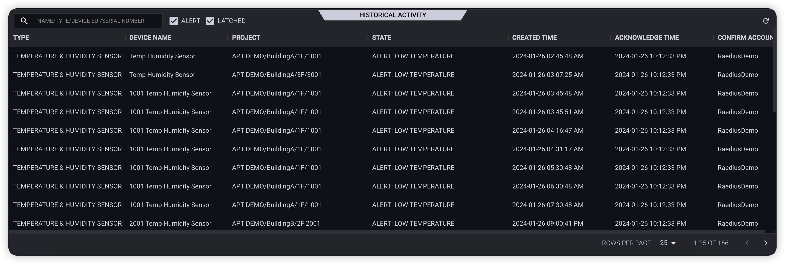

* 查看基础统计数据
* 查看系统当前活动
* 查看系统历史活动
* 解除设备告警
* 解锁设备

## 查看基础统计数据

* 总设备数
* 在线设备数
* 离线设备数
* 当前告警数量
* 当前锁定数量

## 查看系统当前活动

## 查看系统历史活动

## 解除设备告警

当设备告警状态确认已经清楚后，可以通过点击 **确认告警** 按钮手动解除设备告警状态  

设备告警数据有以下两个来源

* 设备个性化  
  
  用户可以在 **设备管理>设备详情>个性化** 中定义设备告警条件(系统为了减少用户操作定义了基础的告警类型以及条件)

* 自定义告警 & 动作配置  
  
  用户可以在 **告警中心>告警定义** 中创建自定义告警，然后通过动作配置，增加一个创建告警的动作，定义设备告警的行为

## 解锁设备

当设备被锁定后，在未手动解锁前设备将处于锁定状态，设备锁定可能出于以下两种原因

* 被设备个性化锁定，**设备管理>设备详情>个性化** 中查看  
  
  当设备被个性化锁定时，在未手动解锁前，设备将处于锁定状态，相同个性化不会再次触发设备锁定  

* 被动作配置锁定，参考动作配置章节  
  
  当设备被动作配置触发条件锁定时，在未手动解锁前，动作配置将不会被该设备相同的触发条件触发执行  
