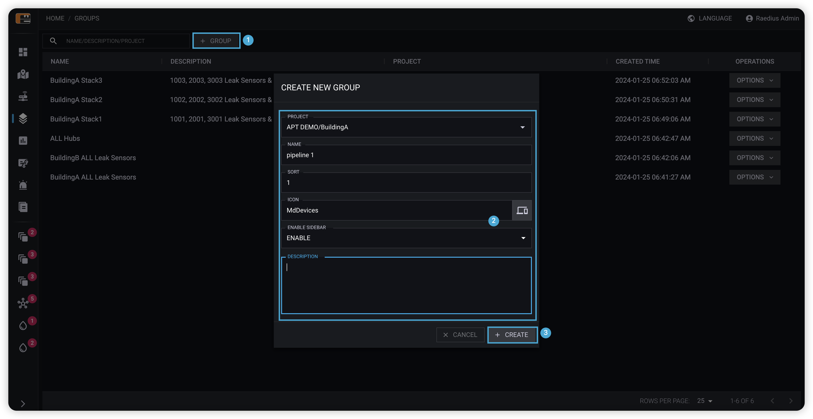

## 何时需要设备分组？

* 重点关注设备
  
  我们可以把重点关注的设备放到一个设备组，然后添加到侧边栏，这样可以快速找到我们需要进行重点关注的设备。

* 需要指定的设备集进行控制
  
  某几个设备行为发生变化时，我们希望系统能够执行一些动作，例如关闭阀门，触发声光报警器，发送通知等，这时我们可以把这些关联设备放到设备组内，配合组级AP达到目的。

## 设备组创建

  

1. 点击**设备组**按钮。
2. 在弹出框表单中填写分组信息。
3. 点击**创建**按钮完成设备组创建。

## 设备组详情

  

### 设备添加

  

  

1. 点击**设备**按钮。
2. 在弹出框选择需要添加到分组的设备。
3. 点击**确认**按钮完成设备添加。

### 设备移除

  

1. 点击需要移除的设备的**移除**按钮。
2. 在确认弹框中点击**确认**按钮，完成设备移除分组。

### 设备组动作配置

组级动作配置作用于分组内设备，关于动作配置更多内容参考动作配置文档。

  
