## 基础概念

### 触发器

触发器用于描述此动作配置何时执行，当动作配置中存在多个触发器时，仅需满足一个触发条件此动作配置将会往下执行。

#### 触发器类型

* 设备触发
* 定时触发（计划中）

#### 触发条件类型

* 在线/离线（设备触发）
* 低信号（设备触发）
* 低电量（设备触发）
* 属性（设备触发）
* 状态变更（设备触发）
* 个性化 （设备触发，不建议使用将废弃）

:::tip
属性触发条件与状态变更触发条件区别在于，属性触发每当设备上报状态若符合触发器条件则动作配置往下执行，而状态变更触发会优先检查设备状态是否发生改变再判断是否满足触发器条件。

举例：水浸传感器在检测到水后，默认每5分钟上报水检测事件直至水浸状态清除，基于属性触发的触发器在水浸状态清除期间会每5分钟执行一次，而基于状态变更的触发器则只会执行一次。

:::

#### 持续时间

状态持续时间，举例：在水浸检测场景下，我们希望如果水浸状态5分钟内如果不能恢复则执行动作配置，我们可以把持续时间参数设置为5分钟以达到此目的。

#### 设备类型

如果动作配置类型是 **组级动作配置、项目级动作配置**，我们可以为触发器设置设备类型，意味着该触发器仅对指定类型设备生效。

#### 设备选择

如果动作配置类型是 **组级动作配置、项目级动作配置**，我们可以为触发器指定设备，意味着该触发器仅对指定设备生效。

#### 属性

当触发器条件类型为 **属性** 时， 我们需要为此触发器设置触发的属性。

#### 操作符

当触发器条件类型为 **属性** 时， 我们需要为此触发器设置操作符。

#### 值

当触发器条件类型为 **属性** 时， 我们需要为此触发器设置参考值。

### 锁定

当锁定被启用时，若设备满足该触发器条件将被触发器锁定，在未手动解锁前，锁定设备将不会被该触发器再次触发。

:::tip

举例：我们设置了一个基于属性的触发器，当温度 > 38°C 时触发，并且勾选了锁定选项，当设备上报温度满足触发条件后，设备将会被该触发器锁定，后续即使该锁定设备上报温度> 38°C，触发器也不会再次执行，除非用户手动解锁锁定设备（参考仪表台设备解锁）。

设备被某一个动作配置触发器锁定不影响该设备在其他动作配置中触发器的执行。
:::

### 前置条件

动作配置执行的前置条件，若存在多个前置条件则需要所有前置条件满足情况下动作配置才会往下执行。

#### 类型

* 时间范围

#### 日期范围（可选）

当前置条件类型为**日期范围**时，我们可以为前置条件设置日期范围，代表该前置条件在指定日期范围内生效。

#### 开始时间

当前置条件类型为**日期范围**时，我们需要为前置条件设置开始时间，代表该前置条件开始时间。

#### 结束时间

当前置条件类型为**日期范围**时，我们需要为前置条件设置结束时间，代表该前置条件结束时间。

#### 重复

当前置条件类型为**日期范围**时，我们需要为前置条件设置重复规则。

### 过滤条件

动作配置过滤条件，若存在多个过滤条件，若满足其中一个过滤条件，则动作配置不会往下执行。

#### 类型

* 时间范围

#### 日期范围（可选）

当过滤条件类型为**日期范围**时，我们可以为过滤条件设置日期范围，代表该过滤条件在指定日期范围内生效。

#### 开始时间

当过滤条件类型为**日期范围**时，我们需要为过滤条件设置开始时间，代表该过滤条件开始时间。

#### 结束时间

当过滤条件类型为**日期范围**时，我们需要为过滤条件设置结束时间，代表该过滤条件结束时间。

#### 重复

当过滤条件类型为**日期范围**时，我们需要为过滤条件设置重复规则。

### 执行动作

#### 类型

* 消息通知
* 设备调用
* 创建告警

#### 通知类型

当动作类型为**消息通知**时，我们需要为此动作设置通知类型。

* 短信
* 邮件
* 语音呼叫

#### 收件人类型

当动作类型为**消息通知**时，我们需要为此动作设置收件人。

* 设备所有者
  
  设备所有者是动态的，代表的是与触发该动作配置设备处于相同项目的项目联系人和关联用户。

  :::info
  举例：**F1-001** 房间水浸设备检测到漏水，当我们设置收件人为**设备所有者**时，**F1-001** 项目联系人，以及项目关联用户都会接收到消息通知。
  :::

* 项目所有者
  
  项目所有者也是动态的，代表的是与触发该动作配置的设备所属项目的全部直属上级项目（不包含触发设备所在项目）的联系人，以及项目关联用户。

  :::info
  举例：**F1-001** 房间水浸设备检测到漏水，当我们设置收件人为**项目所有者**时，**North Building A，Apartment Water Leak Detection System** 项目联系人，以及项目关联用户都会接收到消息通知。
  :::

* 从用户列表中选择

#### 消息文本

当动作类型为**消息通知**时，我们需要为此动作设置通知文本。

#### 强制大写

强制消息文本转换成大写。

#### 设备类型

当动作类型为**设备调用**时，我们需要为此动作设置设备类型。

#### 设备动作

当动作类型为**设备调用**时，我们需要为此动作设置设备执行动作，例如开关阀门等。

#### 调用范围

当动作类型为**设备调用**时，我们需要为此动作设置设备调用范围。

* 动作配置范围
  
  **设备级动作配置**  

  对与触发该动作配置的设备所在项目设备以及子级项目设备进行调用。

  :::info
  举例：当绑定到项目**North Building A**设备触发了该动作配置，将会调用**F1-001，F1-002，F1-003**中指定类型设备。
  :::

  **组级别动作配置**  

  调用设备组内指定类型设备。

  **项目级动作配置**  
  
  调用动作配置所属项目以及子级项目指定类型设备。

  :::info
  举例：
  若动作配置创建在项目**North Building A**中，则对**North Building A，F1-001，F1-002，F1-003**中指定类型设备进行调用。  
  若动作配置创建在项目**Apartment Water Leak Detection System**中，则对**Apartment Water Leak Detection System，North Building A，F1-001，F1-002，F1-003**中指定类型设备进行调用。
  :::

* 设备范围

  **组级别动作配置**  

  调用设备组内与触发该动作配置的设备在同一层级的指定类型设备。

  **项目级&设备级动作配置**  
  
  调用与触发该动作配置的设备在同一层级的指定类型设备。

* 从设备中选择

#### 告警选择

当动作类型为**创建告警**时，我们需要为此动作设置告警类型（参考告警中心>自定义告警）。

## 设备级动作配置

设备级动作配置操作位于 **设备管理>设备详情>动作配置** 中。

### 设备级动作配置创建

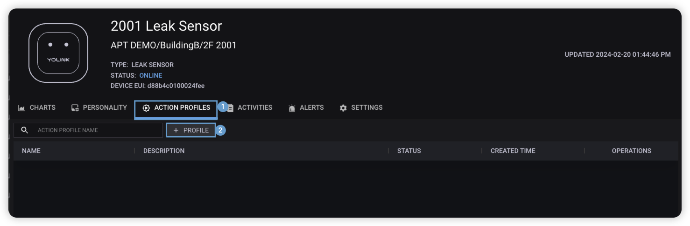  
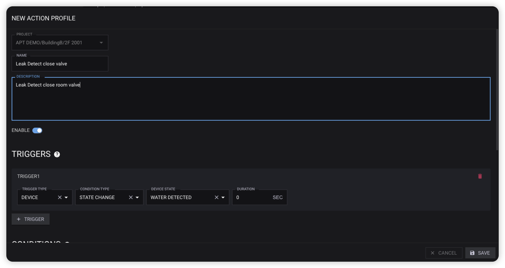  

1. 在设备详情页切换标签到**动作配置**。
2. 点击**动作配置**按钮，新增动作配置。
3. 在动作配置弹框表单中，参照上面文档描述根据实际需求填写动作配置表单。
4. 点击**保存**按钮完成创建。

### 设备级动作配置编辑

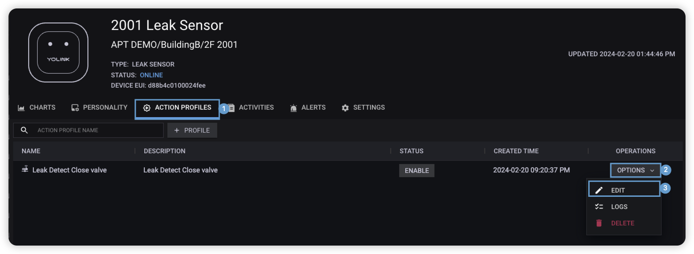  
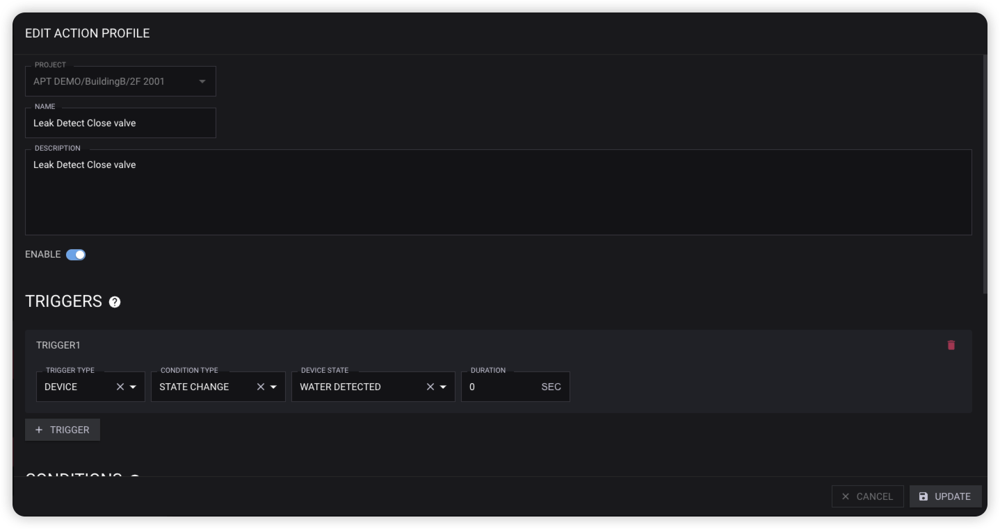  

1. 在设备详情页切换标签到**动作配置**。
2. 点击**动作配置**记录操作按钮。
3. 在操作下拉框中选择**编辑**。
4. 在动作配置弹框表单中，修改动作配置内容。
5. 点击**更新**按钮完成动作配置更新。

### 设备级动作配置删除

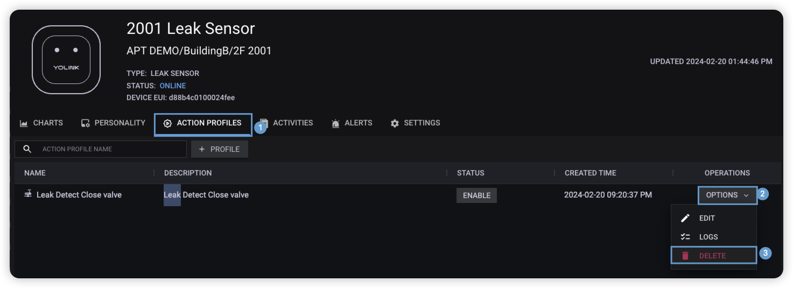  
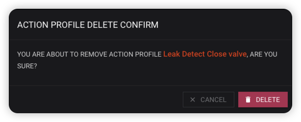  

1. 在设备详情页切换标签到**动作配置**。
2. 点击**动作配置**记录操作按钮。
3. 在操作下拉框中选择**删除**。
4. 在删除确认弹框中点击**删除**，完成动作配置删除。

## 设备组级动作配置

设备组级动作配置操作位于 **设备分组>分组详情>动作配置** 中。

### 设备组级动作配置创建

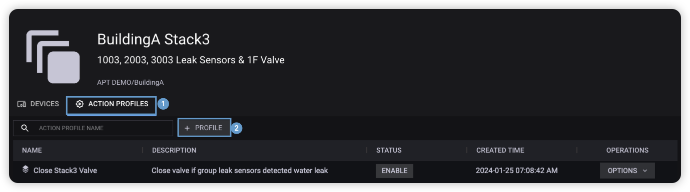  
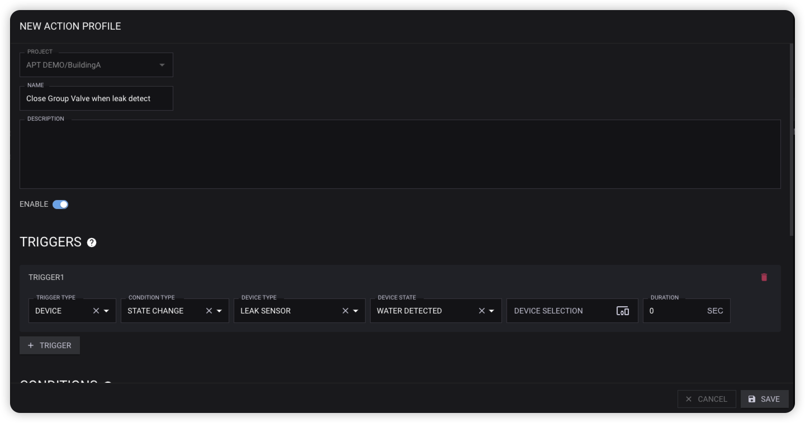  

1. 在设备组详情页切换标签到**动作配置**。
2. 点击**动作配置**按钮，新增动作配置。
3. 在动作配置弹框表单中，参照上面文档描述根据实际需求填写动作配置表单。
4. 点击**保存**按钮完成创建。

### 设备组级动作配置编辑

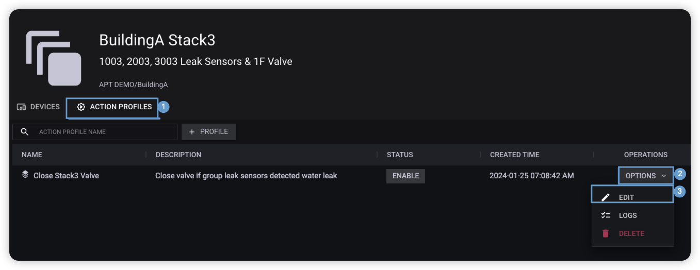  
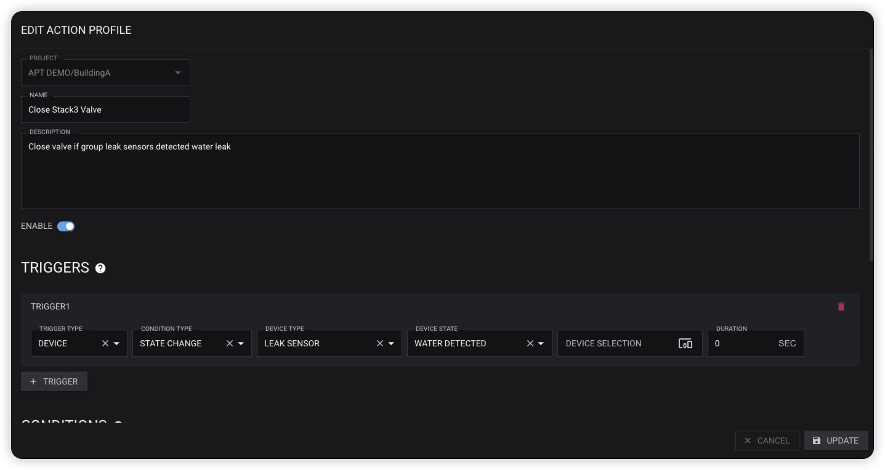  

1. 在设备组详情页切换标签到**动作配置**。
2. 点击**动作配置**记录操作按钮。
3. 在操作下拉框中选择**编辑**。
4. 在动作配置弹框表单中，修改动作配置内容。
5. 点击**更新**按钮完成动作配置更新。

### 设备组级动作配置删除

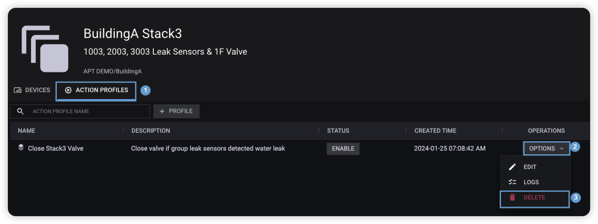  
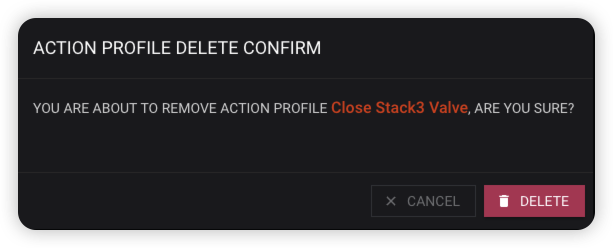  

1. 在设备组详情页切换标签到**动作配置**。
2. 点击**动作配置**记录操作按钮。
3. 在操作下拉框中选择**删除**。
4. 在删除确认弹框中点击**删除**，完成动作配置删除。

## 项目级动作配置

项目级动作配置操作位于 **动作配置** 菜单中。

### 项目级动作配置创建&更新

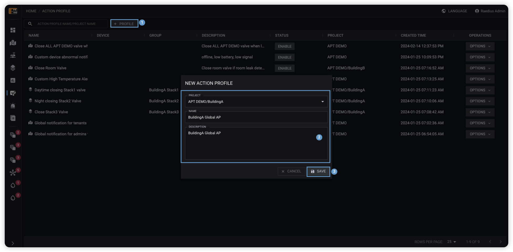  
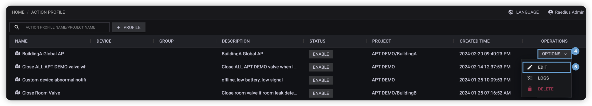  
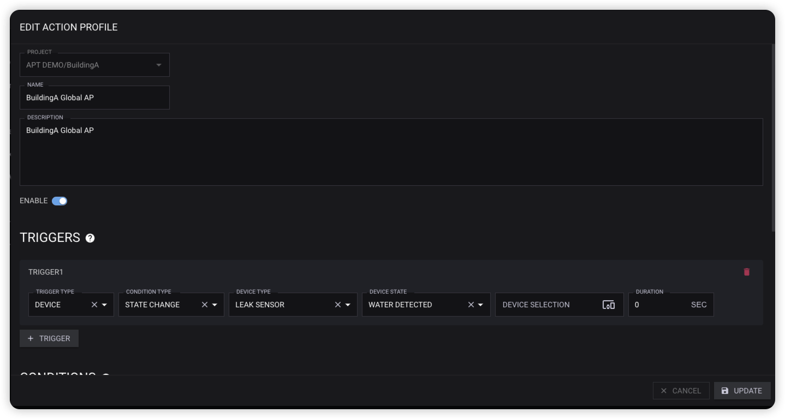  

1. 在动作配置管理页点击**动作配置**按钮。
2. 在动作配置表单弹窗中填写信息。
3. 点击**创建**按钮，新增动作配置。
4. 找到刚创建的动作配置，点击**操作**按钮。
5. 在操作下拉框中选择编辑。
6. 在动作配置弹框表单中，参照上面文档描述根据实际需求填写动作配置表单。
7. 点击**更新**按钮完成更新。

### 项目级动作配置删除

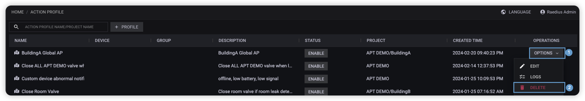  
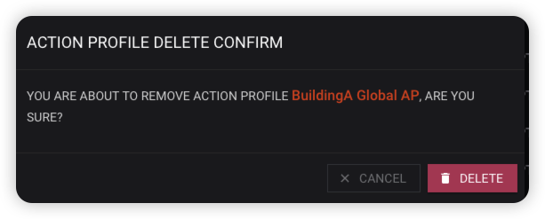  

1. 在动作配置管理页中找到需要删除的**动作配置**，点击**操作**按钮。
2. 在操作下拉框中选择**删除**。
3. 在删除确认弹框中点击**删除**，完成动作配置删除。
