## 设备注册

### 手动添加设备(不推荐)

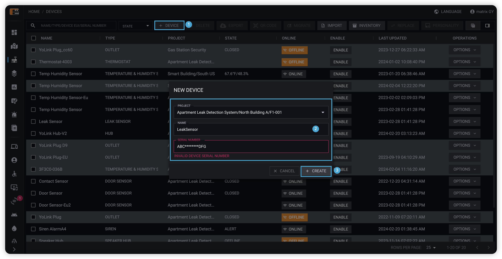

1. 点击**设备**按钮。
2. 在设备添加表单框中选择设备所在项目，设备名称以及设备SN码。
3. 点击**创建**按钮完成设备创建。

:::warning

出于安全考虑，手动添加设备需要提供完整32位SN吗，完整SN码可以通过扫码设备扫码设备背面二维码获取

:::

### 通过Excel导入设备(推荐)

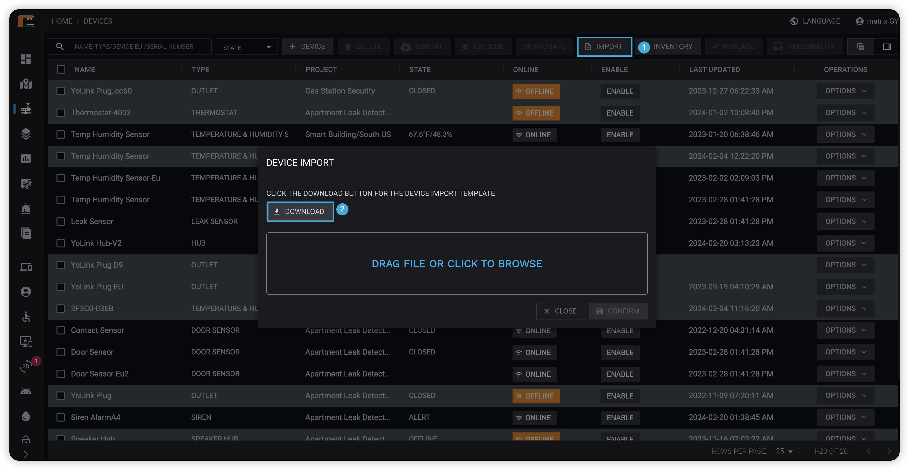  

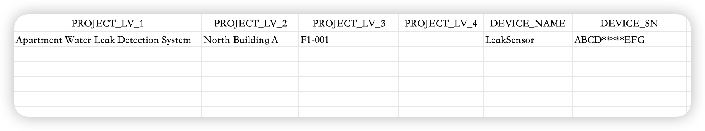  

1. 点击**导入**按钮。
2. 在弹出框中点击**下载**按钮，获取Excel设备导入模板。
3. 填写Excel表格（如果项目尚未创建，系统会自动创建项目）。
4. 上传Excel表格。
5. 在弹出框中点击**确认**按钮完成设备导入。

### 通过YoLink APP导入设备(推荐)

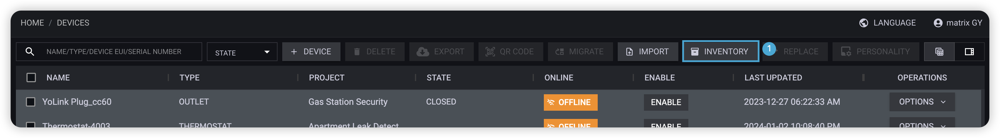  

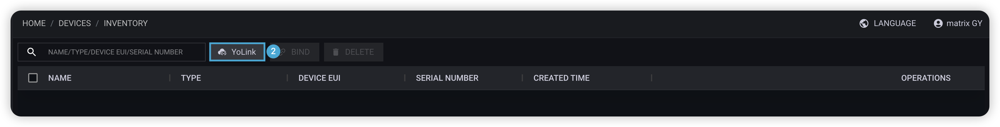  

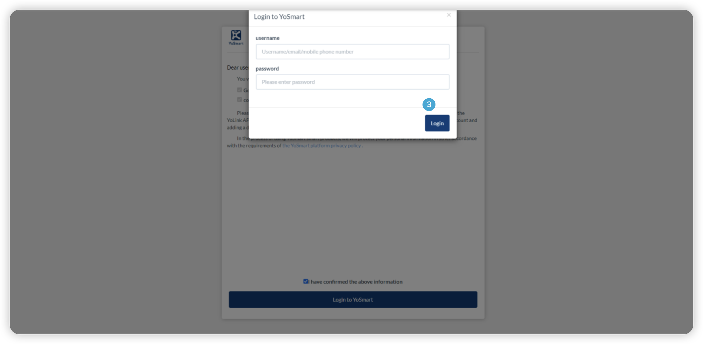  

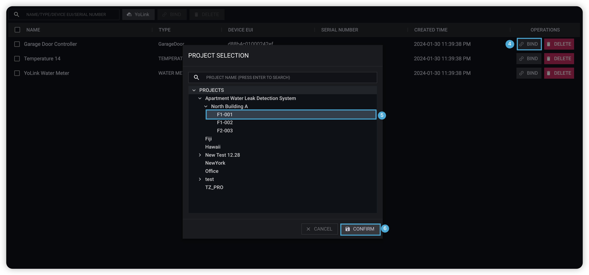  

1. 点击**库存**按钮，进入库存管理页面。
2. 在库存管理页，点击**YoLink**按钮。
3. 跳转到YoLink授权页面后登录YoLink账号，Raedius会从YoLink账号获取设备列表并且添加到库存中。
4. 在库存管理页，找到需要添加的设备，点击**绑定**按钮
5. 在设备绑定弹框中选择设备所在项目
6. 点击**绑定**按钮，完成设备注册

:::info

库存中设备出于未激活状态，系统不会记录设备数据，且库存设备不会占用项目设备配额。

:::

## 设备视图

### 表格视图

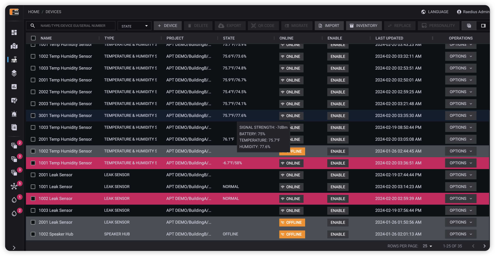  

:::info

设备状态描述

* 红色 设备处于告警状态（个性化中告警定义或自定义告警）
* 灰色 设备处于离线状态
* 黑色 设备出于正常状态

:::

### 卡片视图

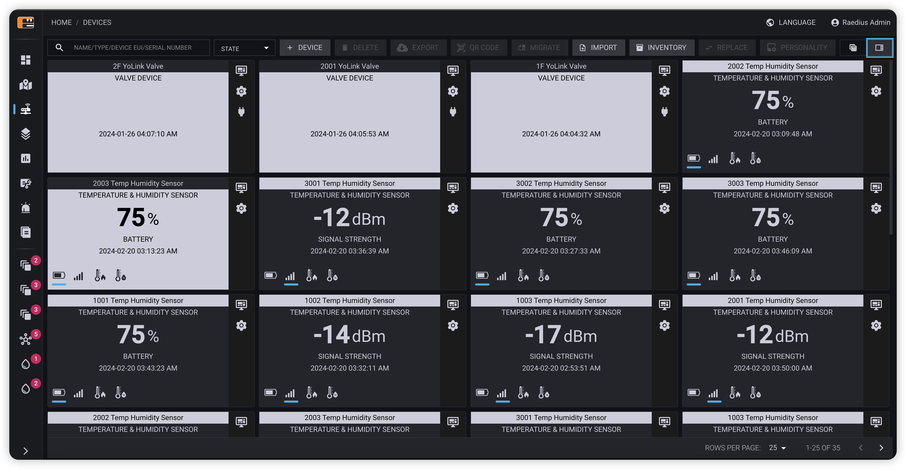  

:::info

设备状态描述

* 卡片交替删除 设备处于离线/告警状态

:::

## 设备编辑

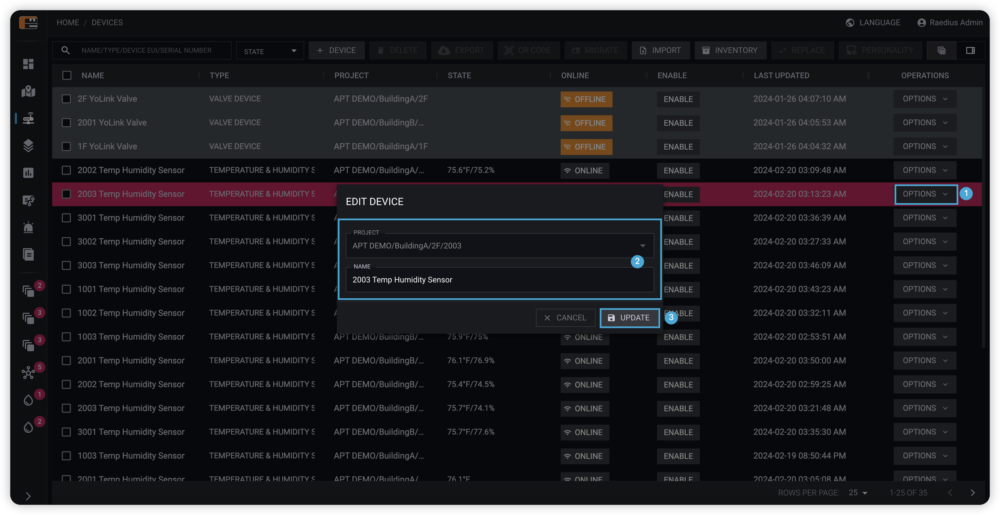  

1. 点击**操作**按钮，在下拉框中选择**编辑**。
2. 在设备信息弹框中修改设备信息。
3. 点击**更新**按钮，完成设备信息变更。

:::info

无法通过设备更新功能修改设备所属项目，如需变更设备所属项目，请使用迁移功能。

:::

## 设备删除

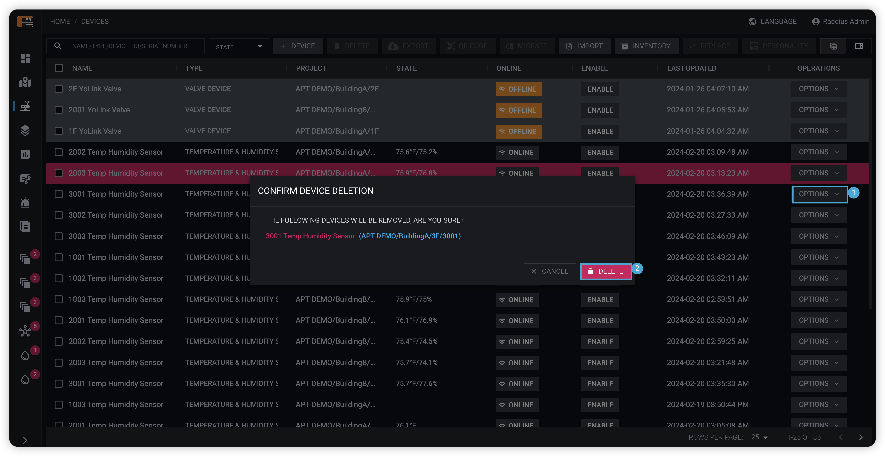  

1. 点击**操作**按钮，在下拉框中选择**删除**。
2. 在设备确认删除弹框中，点击**删除**按钮删除设备。

## 设备历史数据导出

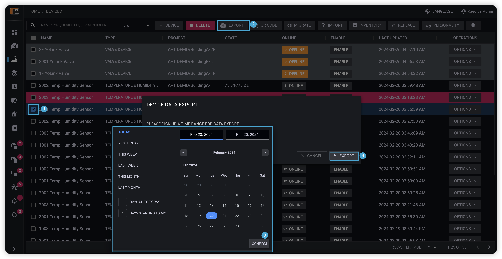  

1. 勾选需要导出数据的设备。
2. 点击操作栏中的导出按钮。
3. 在数据导出确认弹框中，选择数据导出范围（不超过12个月）。
4. 点击弹框中的**导出**按钮完成数据导出。

## 设备二维码导出

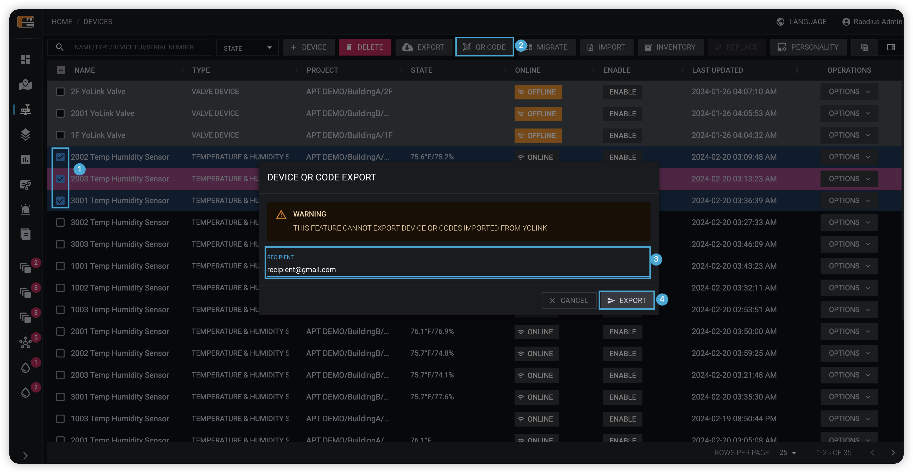  

1. 勾选需要导出二维码的设备。
2. 点击操作栏中的导出二维码按钮。
3. 在二维码导出确认弹框中，填写接收二维码数据的邮箱地址。
4. 点击弹框中的**发送**按钮完成二维码导出。

:::warning

出于数据安全考虑，暂不支持导出通过YoLink APP导入设备的二维码。

:::

## 设备迁移

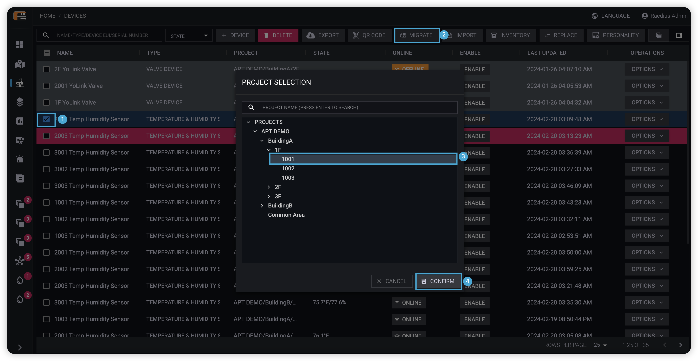  

1. 勾选需要迁移的设备。
2. 点击操作栏中的导出**迁移**按钮。
3. 在弹框中选择设备新所属项目。
4. 点击弹框中的**确认**按钮完成设备迁移。

:::warning

请注意：设备迁移可能会对以下功能产生影响

* 设备分组
* 动作配置

:::

## 设备详情

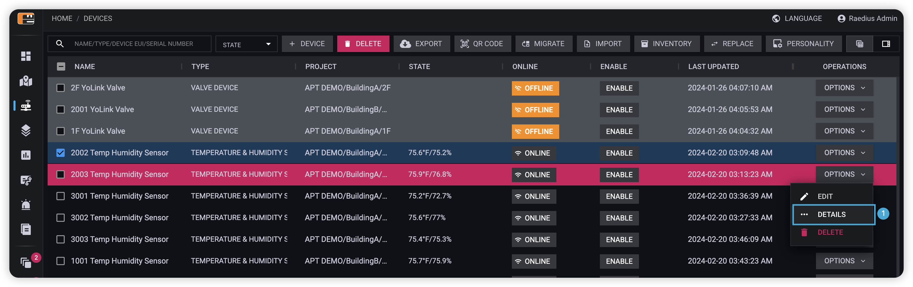  

### 设备图表

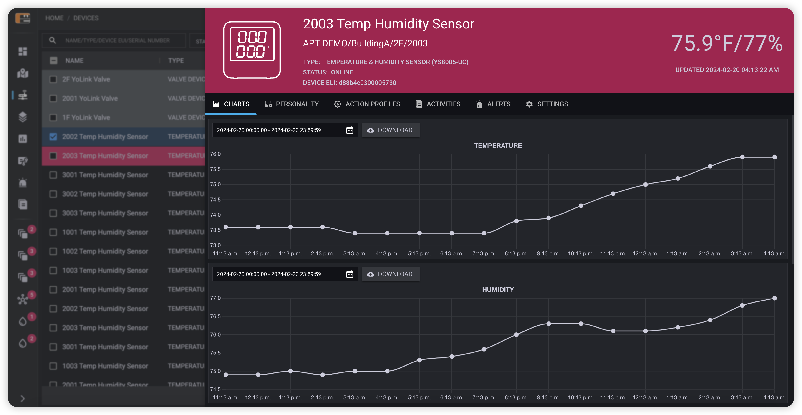  

### 设备个性化

为了降低用户使用门槛，Raedius通过设备个性化定义了设备默认告警行为以及锁定行为，您可以通过修改设备个性化做出调整。

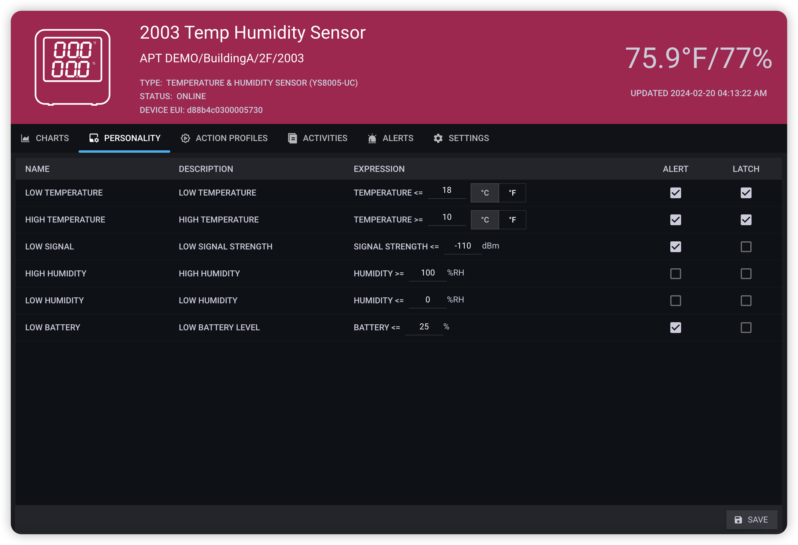  

### 设备动作配置

用户可以通过设备动作配置定义当设备处于何种状态时执行指定的动作，这类似于设备自动化。设备级动作配置仅作用于当前设备，除设备级动作配置外Raedius还提供了组级别以及项目级的动作配置，关于动作配置更多内容参考动作配置文档。

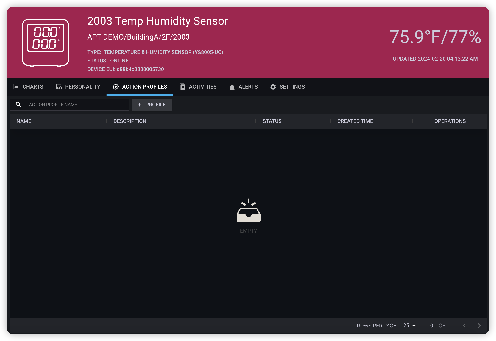  

### 设备活动

设备活动记录了设备的活动历史，例如设备注册，状态变更（在线/离线/告警/温度变化等）

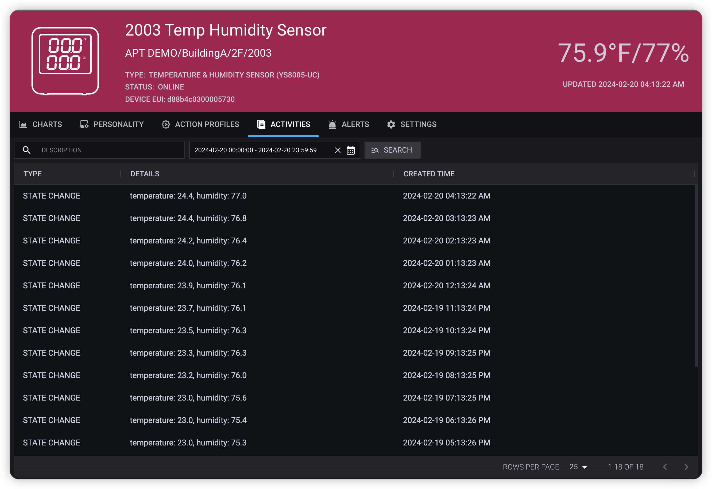  

### 设备告警历史

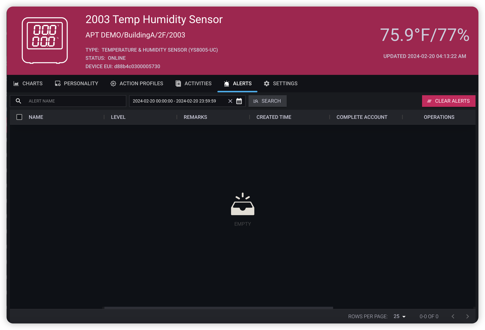  

### 设备设置项

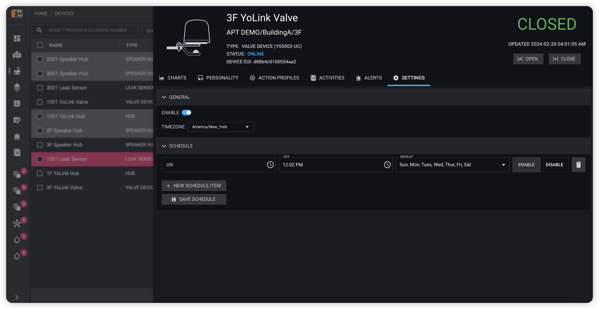  
