## 项目创建

通过下面这个公寓漏水检测项目的场景，演示如何建立项目层级结构。

```text
Apartment Water Leak Detection System
├── North Building A
│   └── F1-001
│   └── F1-002
│   └── F2-003
```

在这个例子中

使用 **Apartment Water Leak Detection System** 作为一级项目  
使用 **North Building A** 楼栋作为二级项目  
使用 **F1-001, F1-002, F2-003** 房间作为三级项目  

Step1: 创建一级项目 **Apartment Water Leak Detection System**

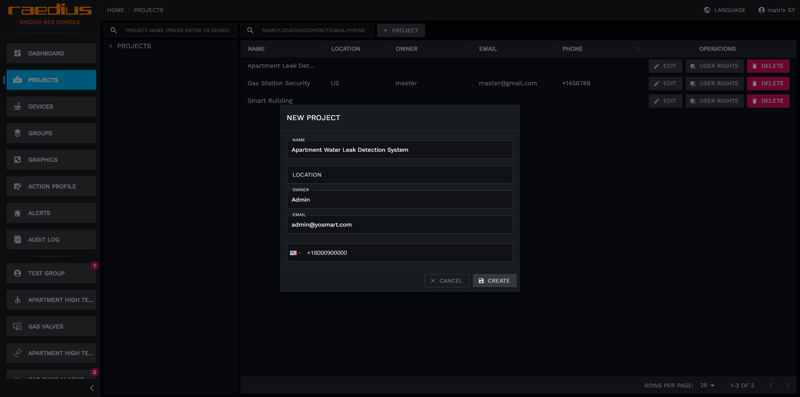

1. 点击**项目管理**进入项目管理页面
2. 点击右侧**PROJECT**按钮
3. 在弹框表单中填写项目信息
4. 点击**保存**按钮完成项目创建

:::info

项目表单中的联系人信息，可用于**动作配置**作为消息接收人，Raedius服务提醒将会通过短信邮件的发送到一级项目联系人

拓展内容：

设备所有者：设备直接关联的项目联系人，以及项目直接关联的用户，举例：**F1-001** 项目绑定了水浸设备，当水浸设备检测到漏水，且AP中配置消息接收者为 **设备所有者**，此时 **F1-001** 项目填写的联系人，以及 **F1-001** 关联用户将会收到通知(项目用户管理)  

项目所有者：设备直接关联的项目的所有上级项目联系人以及用户，举例：**F1-001** 项目绑定了水浸设备，当水浸设备检测到漏水，且AP中配置消息接收者为 **项目所有者**，此时 **North Building A，Apartment Water Leak Detection System** 项目填写的联系人，以及 **North Building A，Apartment Water Leak Detection System** 关联用户将会收到通知  
:::

Step2: 创建二级项目 **North Building A**

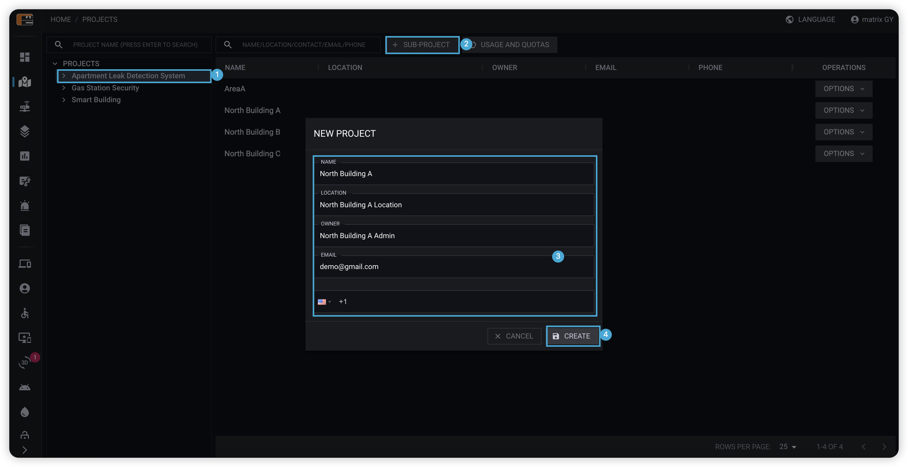

1. 点击**项目管理**进入项目管理页面
2. 点击左侧项目树中**Step1**创建的一级项目 **Apartment Water Leak Detection System**
3. 点击右侧**SUB-PROJECT**按钮
4. 在弹框表单中填写项目信息
5. 点击**保存**按钮完成项目创建

Step3: 重复步骤2完成项目 **F1-001, F1-002, F2-003** 创建

## 项目编辑

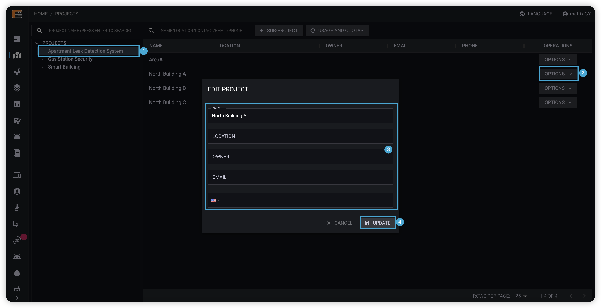

1. 点击**项目管理**进入项目管理页面
2. 通过点击左侧项目数从右侧列表找到需要修改的项目
3. 点击需要修改项目的**操作**按钮，从下拉列表中点击**编辑**
4. 在弹框表单中变更项目信息
5. 点击**更新**按钮完成项目变更

## 项目删除

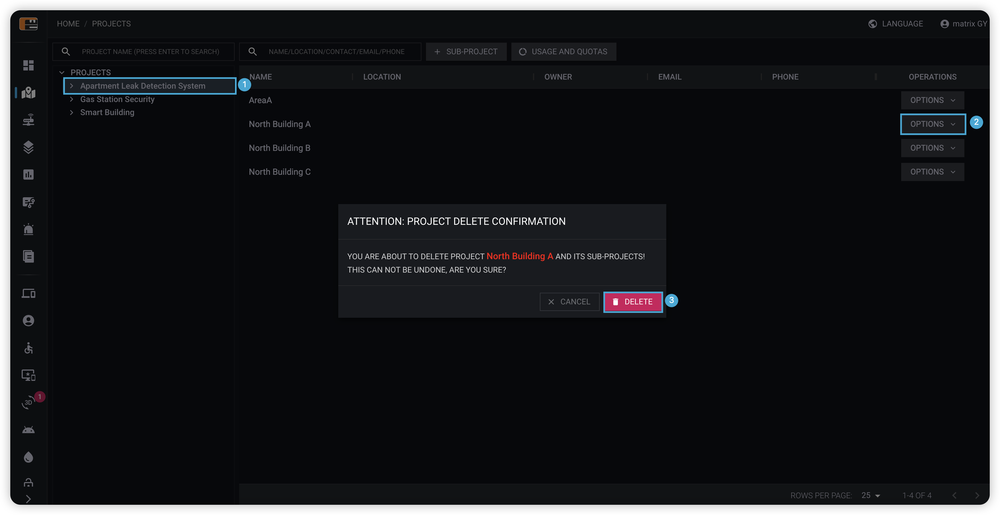

1. 点击**项目管理**进入项目管理页面
2. 通过点击左侧项目数从右侧列表找到需要删除的项目
3. 点击需要修改项目的**操作**按钮，从下拉列表中点击**删除**
4. 在确认弹框中点击**删除**按钮删除项目

:::warning

注意：项目删除操作不可逆，当项目被删除后以下数据也会同时被删除，请谨慎操作。

* 子级项目
* 项目关联设备以及子级项目关联设备
* 项目关联分组以及自己项目管理分组
* 项目关联动作配置以及子级项目关联动作配置
* 项目关联用户，以及子级项目关联用户
* 项目关联告警，以及子级项目关联告警

:::

## 用户和权限管理

项目的各个层级均可创建用户和角色。

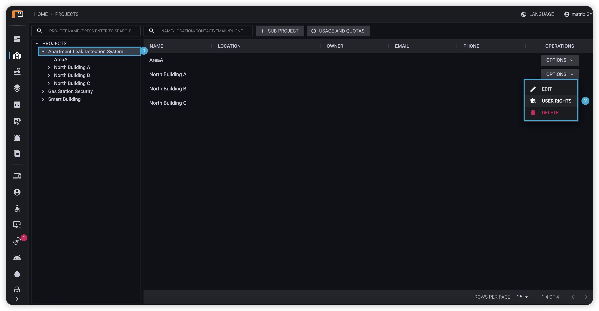

1. 点击**项目管理**进入项目管理页面
2. 通过点击左侧项目数从右侧列表找到需要操作项目
3. 点击需要修改项目的**操作**按钮，从下拉列表中点击**用户权限**

### 用户创建

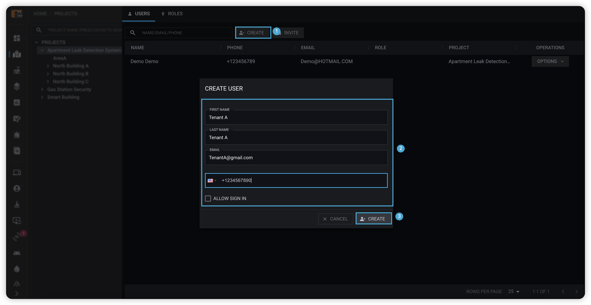

1. 点击**创建按钮**
2. 在弹出框表单中填写用户信息
3. 点击**创建按钮**完成用户创建

:::info

如果勾选了允许用户登录，还需要填写以下内容

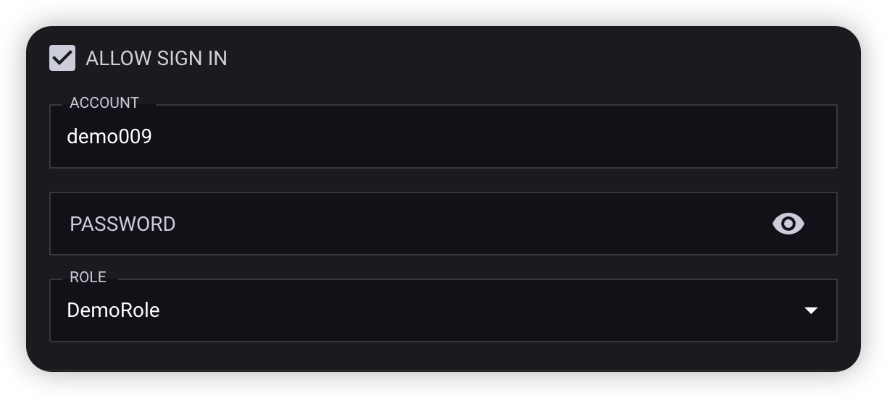

1. 账户名
2. 登录密码
3. 账户角色(请先创建角色)

注意：当前项目用户不能越级使用在上级项目中创建的角色。

:::

### 用户邀请

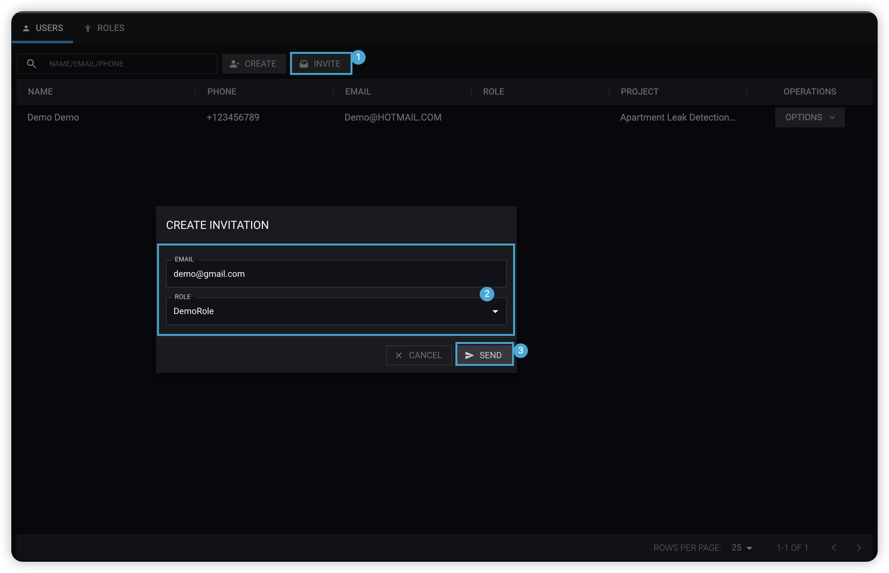

1. 点击**邀请按钮**
2. 在弹出框表单中填写受邀用户邮件以及角色
3. 点击**发送**按钮
4. 受邀用户接收到邮件后点击邀请链接接收邀请(创建新账号或者使用已有账号)

### 用户编辑

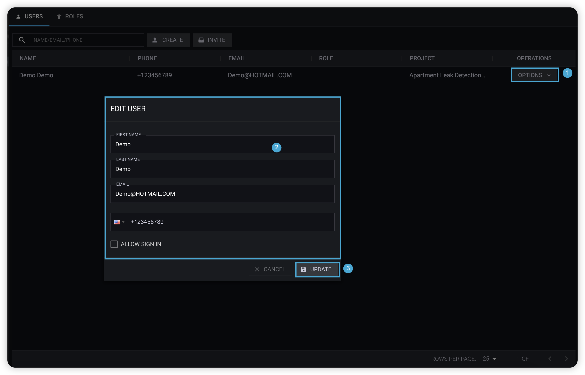

1. 点击需要变更用户记录**操作**按钮，在下拉框中选择**编辑**
2. 在弹出框表单中变更用户信息
3. 点击**更新**完成用户信息变更

:::warning

通过邀请方式添加到项目的用户信息不能被修改。

:::

### 用户删除

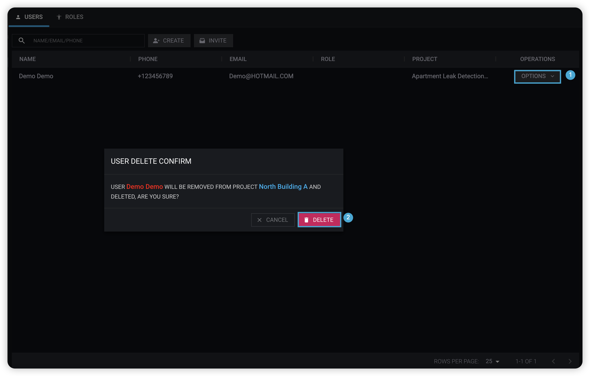

1. 点击需要删除用户记录**操作**按钮，在下拉框中选择**删除**
2. 点击**删除**完成用户删除

:::warning

通过邀请方式添加到项目的用户不能被删除，只能从项目中移除。

:::

### 创建与邀请

1. 如果用户希望通过一个账号管理多个项目，请使用邀请方式将用户添加到项目。
2. 管理员无法变更通过邀请方式添加到项目的用户信息，只能变更用户在项目中的角色。
3. 管理员无法删除通过邀请方式添加到项目的用户，只能将用户从项目中移出。
4. 通过邀请方式添加的用户，默认可以登录到Raedius。

### 角色创建

在项目中创建的角色默认具有当前层级以及下级项目的数据访问权限

举例：在一级项目 **Apartment Water Leak Detection System** 中创建的角色，角色可以访问该项目下所有数据，但在二级项目 **North Building A** 中创建的角色，仅能访问 **North Building A** 及期下级项目数据。

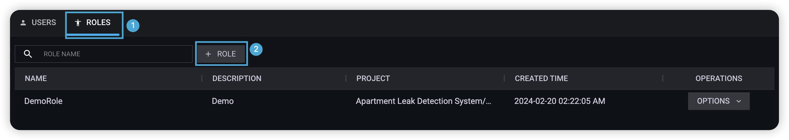  


1. 切换标签到**角色**。
2. 点击**角色**按钮。
3. 填写角色名称、描述勾选角色权限。
4. 点击**保存**按钮完成角色创建。

### 角色编辑

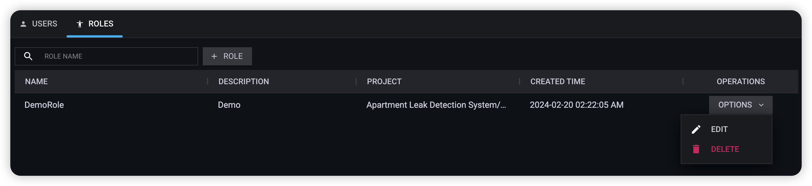  

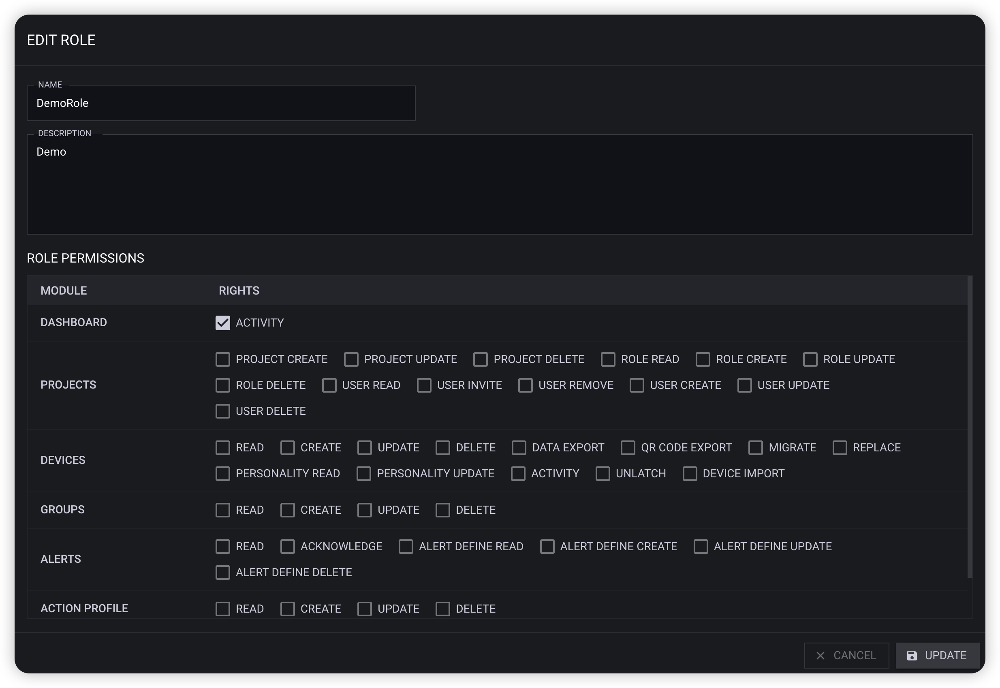

1. 切换标签到**角色**。
2. 点击需要编辑的角色记录**操作**按钮，在下拉框中选择**编辑**。
3. 修改角色名称、描述勾选角色权限。
4. 点击**更新**按钮完成角色更新。

### 角色删除

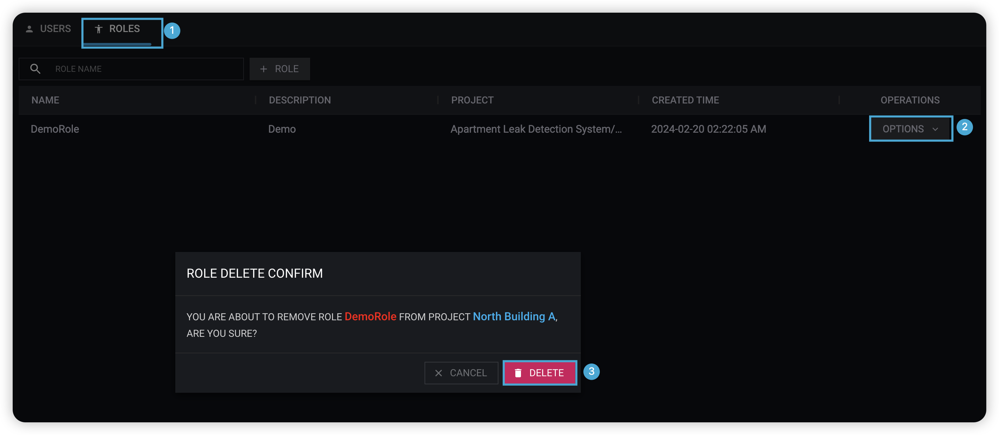

1. 切换标签到**角色**。
2. 点击需要删除的角色记录**操作**按钮，在下拉框中选择**删除**。
3. 在角色删除确认弹框中点击**删除**按钮完成角色删除。
